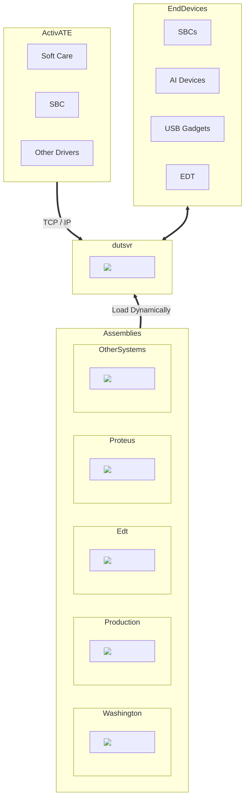

```mermaid
graph TD

    subgraph ActivATE
      SoftCare["Soft Care"];
      SBC;
      otherdevices["Other Drivers"];
    end

    subgraph dutsvr
      image[<img src="./dutsvr.png"/>];
    end

    subgraph Assemblies

      subgraph Washington
        washington[<img src="./dll.png"/>];
      end

      subgraph Production
        production[<img src="./dll.png"/>];
      end

      subgraph Edt
        edt[<img src="./dll.png"/>];
      end

      subgraph Proteus
        proteus[<img src="./dll.png"/>];
      end

      subgraph OtherSystems
        otherSystems[<img src="./dll.png"/>];
      end

    end
  
    subgraph EndDevices
      SBCs;
      AIDevices["AI Devices"];
      USBGadgets["USB Gadgets"];
      EDT;
    end

  ActivATE ==>|TCP / IP| dutsvr;
  EndDevices <==> dutsvr;
  Assemblies ==> |Load Dynamically| dutsvr;
  dutsvr ~~~ Assemblies;
```